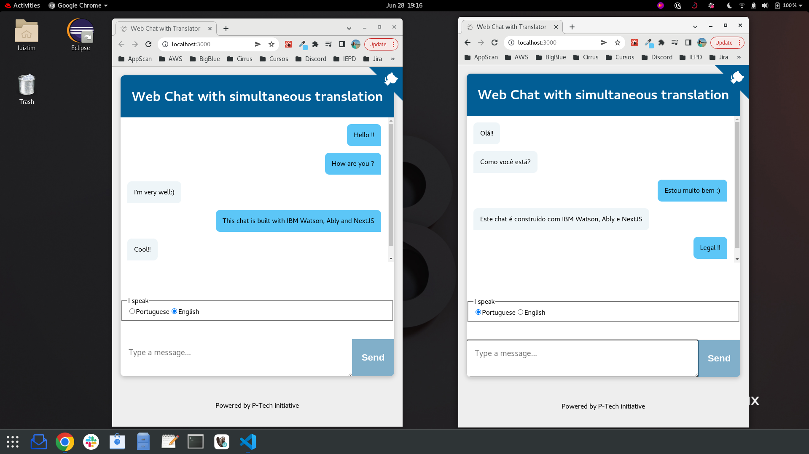

# Description

Realtime chat app that automatically translates messages from Portuguese to English and vice-versa.

It uses Ably service for messages sending and IBM Watson Translation service for translation.

This is a [Next.js](https://nextjs.org/) project bootstrapped with [`create-next-app`](https://github.com/vercel/next.js/tree/canary/packages/create-next-app).

Thanks [Guilherme Oka](https://github.com/ghomarques) for the initial ideas on how to accomplish this. Thank you for all the fish as well...



## Dependencies

In order to build this app, you will need:

* **An IBM Cloud Account** for Watson Translation Service: [Create an account with IBM Cloud for free](https://cloud.ibm.com/registration).
* **An Ably account** for sending messages: [Create an account with Ably for free](https://www.ably.io/signup).
* **Node 12** (LTS) or greater: [Install Node](https://www.notion.so/Instalando-o-Node-js-d40fdabe8f0a491eb33b85da93d90a2f).
* **Yarn** for project dependencies management: [Install Yarn](https://www.notion.so/Instalando-o-Yarn-eca6a13be5b3467d8d2f7be15c60f322).

## Local dev pre-requirements

### Ably 

You'll need an API key from Ably to authenticate with the Ably Service. To get an API key, once you have created an Ably account:

1. Visit your [app dashboard](https://www.ably.io/accounts/any) and click on "Create New App".
2. Give the new app a name
3. Copy the Private API key once the app has been created. Keep it safe, this is how you will authenticate with the Ably service.


### IBM Watson services

Provision the **Language Translator** service clicking [here](https://cloud.ibm.com/catalog/services/language-translator)

#### Gather credentials

* From the main navigation menu (☰), select **Resource list** to find your **Language Translator** service under **Services**.
* Click on **Language Translator** service to find the **Manage** view where you can collect the **API Key** and **URL**

## Building the Realtime Chat App

1. Create a copy of `.env.example` file, naming it `.env` in the root of the directory, this is where we'll put the project's environment variables.
2. Add your keys to the .env file:
```
ABLY_API_KEY=your-ably-api-key:goes-here
LANGUAGE_TRANSLATOR_APIKEY=your-watson-api-key:goes-here
LANGUAGE_TRANSLATOR_URL=your-watson-url:goes-here
```
3. Navigate to project application directory and type into the console:

```bash
yarn
```

Yarn will download all project libraries

4. To start your project, type into the console

```bash
yarn dev
```

Your project will be available on http://localhost:3000

5. Alternatively, you can build the project for production using the following command

```bash
yarn build
```

Execute the production build using the following command

```bash
yarn start
```

## Deploy the server

Click on button below for instructions on deploying the Node.js server.

[](doc/cf.md)

## Use the web app

1. Browse to your app URL

   * Use the URL provided at the end of your selected deployment option.

1. Select the language you speak

1. Start chatting
